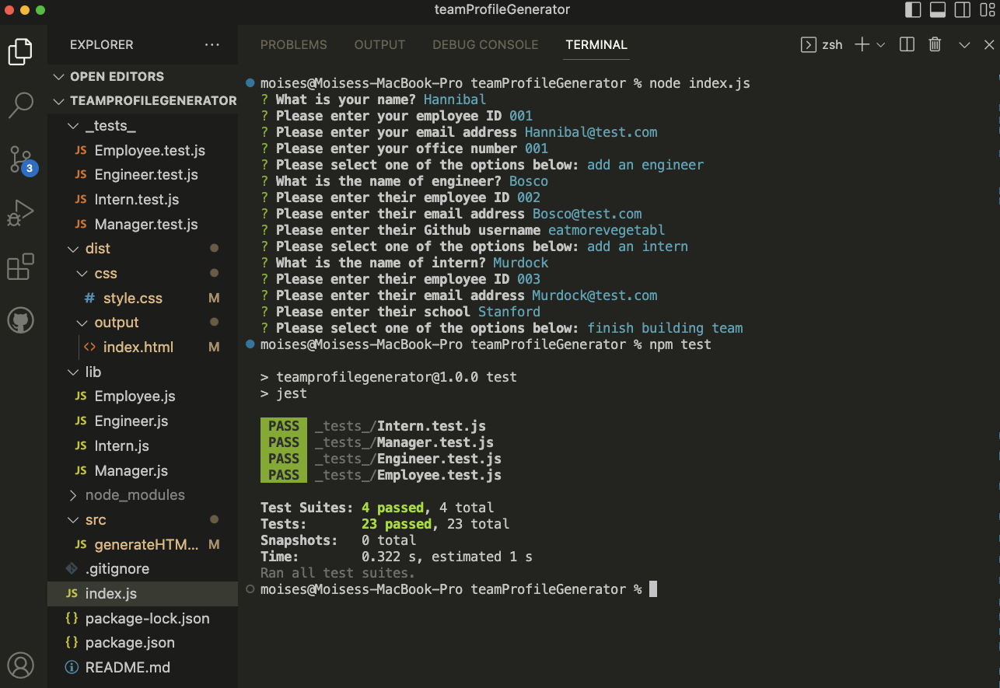
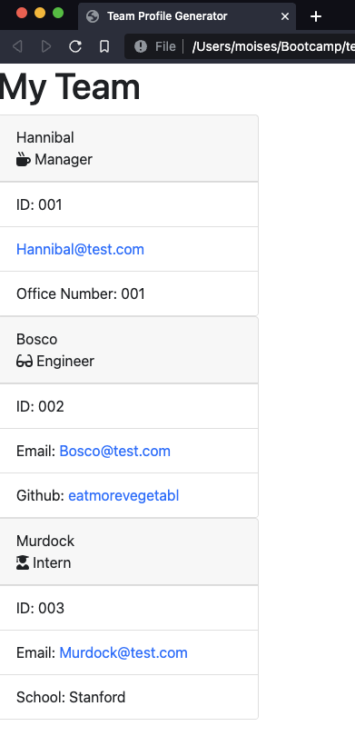

# Profile Generator

## Description

This app generates an HTML page that displays answers from prompted questions in the terminal. It's purpose is to list the members of a team, along with their respective roles and other info. To initiate the app, one has to type "node index.js" in the terminal and follow the steps. It uses the inquirer package.
The app also has tests, those are initiated by typing "npm test" in the terminal.

## Visuals

## Video Link

https://drive.google.com/file/d/1zarcLlI6BwYCc21QwvbQIObNBdHGS3g4/view
